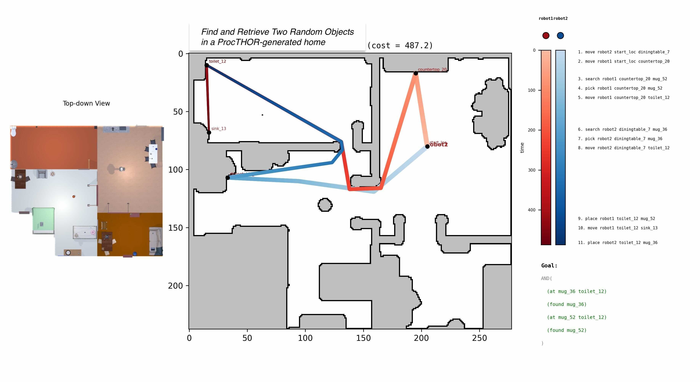

# `railroad` : Concurrent multi-agent, probabilistic planning framework

**Multi-Agent Task Planning, supporting concurrency and probabilistic effects. PDDL-inspired operators with a Python API**

The `railroad` planning framework is meant to support **concurrent multi-robot task planning under uncertainty**. Operators are PDDL-like and defined in Python, so that learned estimators can be used to specify timing, probabilities, and costs. Planning is C++-based for efficiency, and uses MCTS with an uncertainty-aware FF heuristic (_still a work in progress_) as its value function.

*Developed by the [Robot Anticipatory Intelligence & Learning (RAIL) Group @ GMU](https://people.cs.gmu.edu/~gjstein/), led by Prof. Gregory J. Stein.*

#### Key properties
- **States store both active fluents and upcoming effects**: actions add effects to a queue, which update the active fluents as time advances.
- **Concurrency**: state transitions advance time until an agent is marked `(free {agent_name})`, letting multiple robots act concurrently.
- **Probabilistic state transitions**: effects can be probabilistic
- **Planning via MCTS**: planning via Monte Carlo Tree Search over joint action spaces

#### Multi-Robot Object Search Example

In this [ProcTHOR](https://procthor.allenai.org/)-generated household environment, the team is told to search for two objects, with proabilities correlated with their underlying locations, and deliver them at a destionation. The planner coordinates them to search effectively and split up, pirotizing search of the locations where the objects are likely to be.



#### Quickstart via the [`uv`](https://docs.astral.sh/uv/) package manager
```bash
mkdir railroad-env && cd railroad-env && uv init
uv add "railroad @ git+https://github.com/RAIL-group/railroad.git#subdirectory=packages/railroad"
uv run railroad example multi-object-search
```
*Note:* Linux systems require `python3.12-dev` and `build-essential`.

Use the optional benchmark suite
```bash
# Install with railroad[bench]
uv add "railroad[bench] @ git+https://github.com/RAIL-group/railroad.git#subdirectory=packages/railroad"
uv run railroad benchmarks run --dry-run  # Inspect what will run
uv run railroad benchmarks run  # Runs all
uv run railroad benchmarks run <filter>  # Runs all with <filter> string

# Run the interactive web dashboard (after starting/running benchmarks)
uv run railroad benchmarks dashboard
```

ProcTHOR is an optional install via `railroad[procthor]`. To run the example from above and generate a video:
```bash
uv add "railroad[procthor] @ git+https://github.com/RAIL-group/railroad.git#subdirectory=packages/railroad"
uv run railroad example procthor-search --seed 8616 --save-video ./procthor-search-8616.mp4 --save-plot ./procthor-search-8616.jpg
```

`railroad` is is heavily type-hinted, and so can be used with a standard type checker, e.g., via `uv run ty check`.

## Quick Example: Two-Robot Object Search

*[Run this example in a Google Colab notebook](https://colab.research.google.com/drive/1jdUtZmKc9OA9LiCSeDdteCqZMGRHik2U?usp=sharing).*

Two robots concurrently move and search to find a Knife and a Cup in a five-room space.

```python
import numpy as np
from railroad.core import Fluent as F, get_action_by_name, State, Operator, Effect
import railroad.operators
from railroad.environment import SymbolicEnvironment
from railroad.planner import MCTSPlanner
from railroad.dashboard import PlannerDashboard

locations = {
    "den":     np.array([5, 5]),
    "kitchen": np.array([0, 0]),
    "bedroom": np.array([10, 0]),
    "office":  np.array([0, 8]),
    "garage":  np.array([10, 8]),
}
objects_by_type = {
    "robot":    {"robot1", "robot2"},
    "location": set(locations),
    "object":   {"Knife", "Cup"},
}
# Ground truth object locations (unknown to robots initially)
true_object_locations = {"kitchen": {"Cup"}, "garage": {"Knife"}}

def move_time(robot, loc_from, loc_to):
    return float(np.linalg.norm(locations[loc_from] - locations[loc_to]))

move = Operator(
    name="move",
    parameters=[("?r", "robot"), ("?from", "location"), ("?to", "location")],
    preconditions=[F("at ?r ?from"), F("free ?r")],
    effects=[  # not free at t=0, free again at destination after move_time
        Effect(time=0, resulting_fluents={F("not free ?r"), F("not at ?r ?from")}),
        Effect(time=(move_time, ["?r", "?from", "?to"]),
               resulting_fluents={F("free ?r"), F("at ?r ?to")}),
    ],
)

@railroad.operators.numeric  # decorator to allow algebraic "1 - prob"
def object_find_prob(robot: str, loc: str, obj: str) -> float:
    objects_here = true_object_locations.get(loc, set())
    return 0.9 if obj in objects_here else 0.2

search = Operator(
    name="search",
    parameters=[("?r", "robot"), ("?loc", "location"), ("?obj", "object")],
    preconditions=[F("at ?r ?loc"), F("free ?r"), F("not found ?obj"),
                   F("not revealed ?loc"), F("not searched ?loc ?obj")],
    effects=[  # after 5s, location is searched, revealing if object is there
        Effect(time=0, resulting_fluents={F("not free ?r")}),
        Effect(time=5.0, resulting_fluents={F("free ?r"), F("searched ?loc ?obj")},
               prob_effects=[  # find object with p=object_find_prob
                   ((object_find_prob, ["?r", "?loc", "?obj"]),
                    [Effect(time=0, resulting_fluents={F("found ?obj"), F("at ?obj ?loc")})]),
                   ((1 - object_find_prob, ["?r", "?loc", "?obj"]), []),
               ]),
    ],
)

# Both robots start free in the den
initial_state = State(0.0, {
    F("free robot1"), F("free robot2"),
    F("at robot1 den"), F("at robot2 den"),
    F("revealed den"),
})

goal = F("found Knife") & F("found Cup")

env = SymbolicEnvironment(
    state=initial_state, objects_by_type=objects_by_type,
    operators=[move, search],
    true_object_locations=true_object_locations,
)

def fluent_filter(f):
    return any(kw in f.name for kw in ["at", "holding", "found"])

with PlannerDashboard(goal, env, fluent_filter=fluent_filter) as dashboard:
    # Plan-act loop: replan whenever a robot becomes free
    for _ in range(20):
        if goal.evaluate(env.state.fluents):
            break

        actions = env.get_actions()
        planner = MCTSPlanner(actions)
        action_name = planner(env.state, goal, max_iterations=10000, c=200)
        action = get_action_by_name(actions, action_name)
        env.act(action)
        dashboard.update(planner, action_name)
```

The planner dispatches both robots in parallel. Sample dashboard output:

```
Actions Taken (5)
         |0.0                       12.1|
  robot1 |1                4            |
  robot2 |2             3           5   |

  1. move robot1 den kitchen
  2. move robot2 den garage
  3. search robot2 garage Knife
  4. search robot1 kitchen Cup
  5. move robot2 garage office

Goal:
  AND(✓(found Knife), ✓(found Cup))

Total cost: 12.1 (seconds)
```

## Built-in Examples

```bash
uv run railroad example <name>
```

- **`multi-object-search`** -- Search for and collect multiple objects with multiple robots
- **`clear-table`** -- Clear objects from a table (demonstrates negative goals)
- **`find-and-move-couch`** -- Cooperative task requiring two robots (demonstrates wait operators)
- **`heterogeneous-robots`** -- Drone, rover, and crawler with different speeds and capabilities
  - Add `--interruptible-moves` to allow rerouting robots mid-transit
- **`frontier-search`** -- Explore unknown space and search discovered sites for objects (requires `railroad[procthor]`)

## Key Concepts

- **Fluent** -- A fact about the world: `F("at robot1 kitchen")`, `F("free robot1")`
- **State** -- The current set of fluents, the time, and any upcoming effects
- **Operator** -- An action template with typed parameters: `move ?robot ?from ?to`
- **Effect** -- A state change that happens at a specified time; can be probabilistic
- **Goal** -- A target condition to achieve, built from fluents with `&`, `|`, and `~`

## Goal Expressions

Goals compose with Python operators:

```python
from railroad.core import Fluent as F

F("found Knife") & F("found Fork")           # AND -- both must be true
F("at robot1 kitchen") | F("at robot1 bed")   # OR  -- at least one
~F("at Knife table")                          # NOT -- must not hold

# Combine freely
goal = (F("found Knife") | F("found Spoon")) & ~F("at Cup table")
```

## Running via this Repo

Requires Python 3.13+ and [`uv`](https://docs.astral.sh/uv/):

```bash
git clone https://github.com/RAIL-group/railroad.git
cd railroad
uv run railroad example multi-object-search   # builds automatically on first run
```

## Architecture

Railroad is organized as a monorepo. The core planning engine lives in `packages/railroad/`:

```
packages/railroad/
  include/               # C++ headers (A* search, MCTS, FF heuristic)
  src/railroad/
    _bindings.cpp        # pybind11 bridge
    core.py              # Fluent, State, Action, Operator, Effect, Goal
    planner.py           # MCTSPlanner (wraps C++ MCTS with automatic preprocessing)
    operators/           # Helper constructors for move, search, pick, place, wait
    navigation/          # Reusable grid navigation (theta* pathing, occupancy grid mixin)
    environment/
      environment.py     # Abstract Environment base class (subclass & override define_operators())
      symbolic.py        # SymbolicEnvironment for simulation and testing
      skill/             # Skill protocols + navigation skill implementations
      procthor/          # Optional AI2-THOR/ProcTHOR 3D simulator integration
    experimental/        # Frontier-based unknown-space exploration
    examples/            # Built-in runnable examples
    bench/               # Benchmarking framework with MLflow + Plotly Dash
```

Additional packages:
- `packages/environments/` -- Extra environment backends (e.g. PyRoboSim)

## Development

```bash
uv run ty check              # type-check (fast, run first)
uv run pytest                # full test suite
uv run pytest -vk <filter>   # run specific tests
```

`uv run` automatically detects changes to source files (including C++) and rebuilds as needed.
